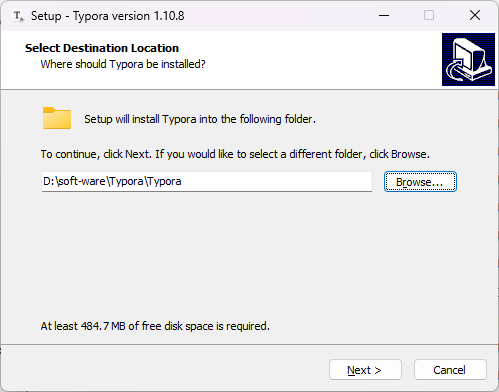
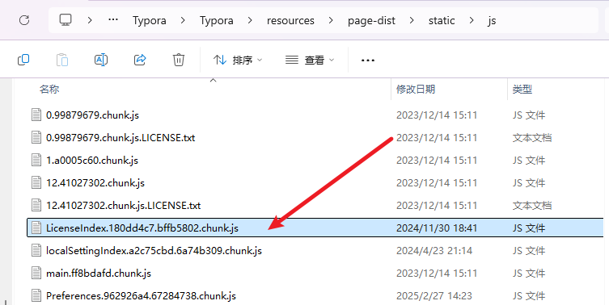
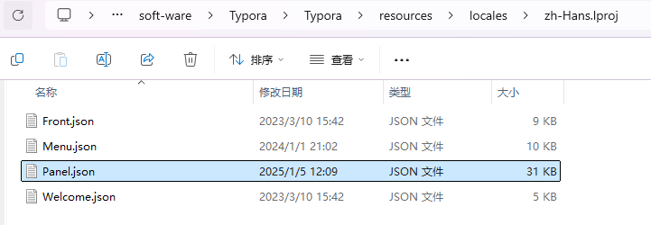
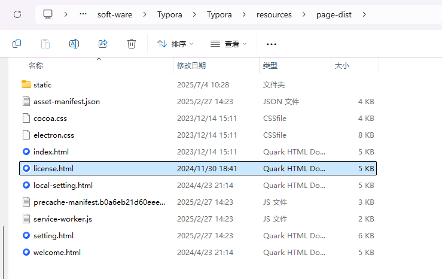

# 免费使用正版的Typora教程【转的文章，用于备份，出处在那边】

## 1. Typora 介绍

Typora 是一款流行的 Markdown 编辑器，以其简洁的界面和所见即所得的编辑方式受到许多用户的喜爱。以下是它的主要特点：

**界面与编辑体验**

- 所见即所得：采用实时预览模式，输入 Markdown 语法时即时显示排版效果，无需切换视图。
- 界面简洁：设计极简，无多余元素，让用户专注于写作。
- 主题丰富：提供多种主题，支持自定义，满足个性化需求。

**功能全面**

- Markdown 语法支持：支持所有常见 Markdown 语法，包括标题、列表、表格、代码块等。
- 图片插入：支持多种方式插入图片，可调整大小和位置。
- 导出格式多样：可将文档导出为 HTML、PDF、Word 等多种格式。
- 跨平台：支持 Windows、macOS 和 Linux 系统。

**其他特点**

- 打字机模式和专注模式：提升写作专注度。
- 快捷键：提供丰富的快捷键，提高操作效率。
- 文件管理：内置文件管理功能，方便文档操作。

## 2. 下载

来到 [Typora 官网](https://typoraio.cn/releases/all)下载 1.10.8 版本安装。

## 3. 安装

傻瓜式安装。

```js
C:\Program Files\Typora\
```


**注意：安装时留意安装路径，后续需要操作这个目录。**



## 4. 激活主程序

1. 从安装目录中找到如下文件：

   ```text
   C:\Program Files\Typora\resources\page-dist\static\js\
   ```

   

2. 用编辑器打开，查找 `e.hasActivated="true"==e.hasActivated`，替换成 `e.hasActivated="true"=="true"`。

3. 保存后重启 Typora，提示已激活。

   

## 5. 隐藏左下角“未激活”文字

```js
C:\Program Files\Typora\resources\locales\zh-Hans.lproj\Panel.json
```


查找：`“UNREGISTERED”:“未激活”`

替换成：`“UNREGISTERED”:“”`



保存后重启 Typora，即可免费使用正版且最新的 Typora。

## 6. 关闭已激活弹窗【可选】

1. 从安装目录中找到如下文件：

   ```text
   C:\Program Files\Typora\resources\page-dist\license.html
   ```

   

2. 用编辑器打开，查找 `</body></html>`，替换成：

   ```html
   </body><script>window.onload=function(){setTimeout(()=>{window.close();},500);}</script></html>
   ```

保存后重启 Typora，激活弹窗会在 500 毫秒后自动关闭。不过可能会报错，可以尝试增加时间；如果仍经常报错，可以跳过这一步，每次手动关闭。